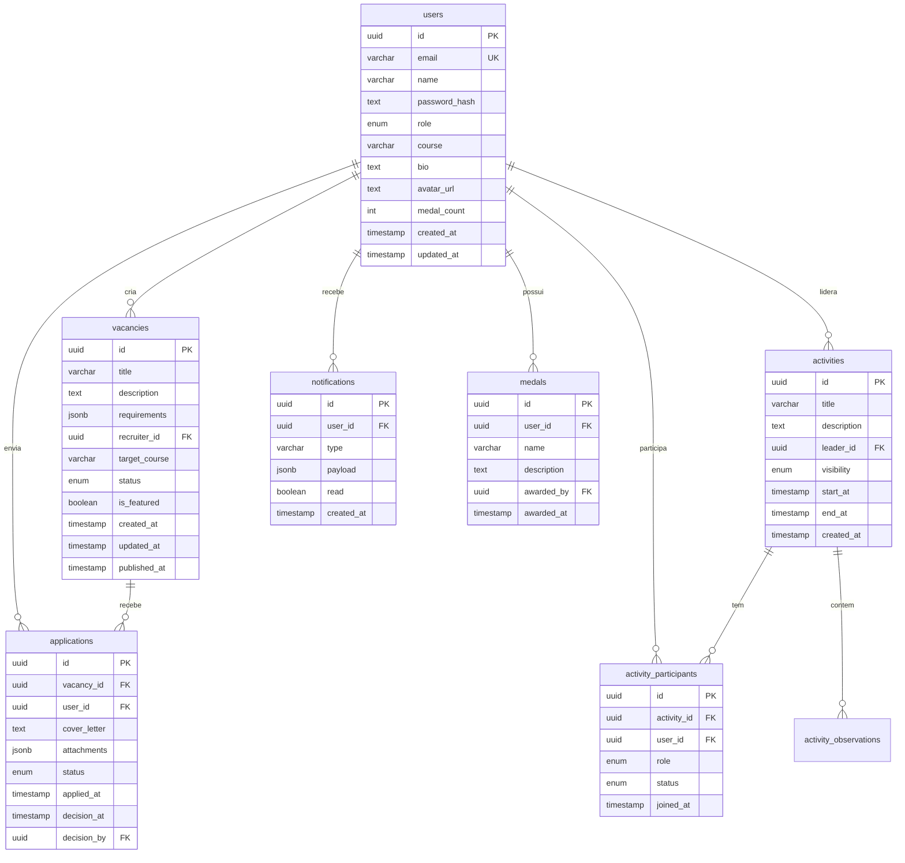
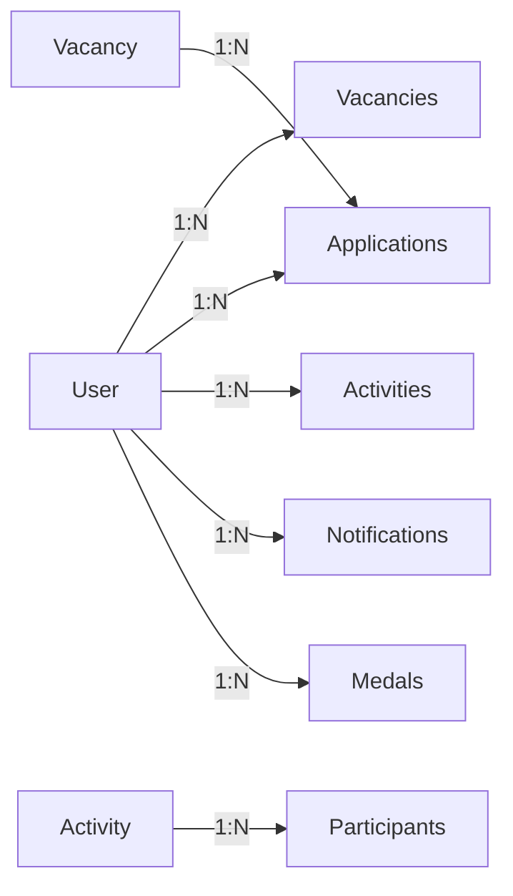
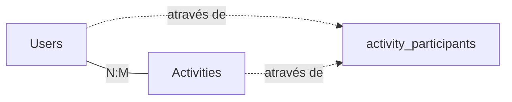

# Modelagem de Dados - ERD

## Visão Geral

O modelo de dados do NeedUK é estruturado para suportar as principais funcionalidades do sistema: gestão de usuários, vagas, candidaturas, atividades colaborativas e notificações.

!!! info "Tecnologias"
    - **Banco de Dados**: PostgreSQL 14+
    - **ORM**: Prisma 5.x
    - **Provider**: Supabase
    - **Versioning**: Migrations automáticas via Prisma

## Diagrama Entidade-Relacionamento



## Entidades Principais

### Users (Usuários)

Tabela central que armazena todos os usuários do sistema.

| Campo | Tipo | Restrições | Descrição |
|-------|------|------------|-----------|
| `id` | UUID | PK | Identificador único |
| `email` | VARCHAR(255) | UNIQUE, NOT NULL | Email do usuário |
| `name` | VARCHAR(255) | NOT NULL | Nome completo |
| `password_hash` | TEXT | NULL | Hash da senha (bcrypt) |
| `role` | ENUM | DEFAULT 'ALUNO' | Tipo de usuário |
| `course` | VARCHAR(100) | NULL | Curso acadêmico |
| `bio` | TEXT | NULL | Biografia |
| `avatar_url` | TEXT | NULL | URL da foto de perfil |
| `medal_count` | INTEGER | DEFAULT 0 | Contador de medalhas |
| `created_at` | TIMESTAMP | DEFAULT NOW() | Data de criação |
| `updated_at` | TIMESTAMP | DEFAULT NOW() | Última atualização |

#### Enum: Role
```sql
CREATE TYPE user_role AS ENUM ('ALUNO', 'RECRUTADOR', 'GESTOR', 'ADMIN');
```

#### Índices
```sql
CREATE INDEX idx_users_email ON users(email);
CREATE INDEX idx_users_role ON users(role);
CREATE INDEX idx_users_course ON users(course);
```

---

### Vacancies (Vagas)

Armazena as oportunidades de emprego/estágio publicadas pelos recrutadores.

| Campo | Tipo | Restrições | Descrição |
|-------|------|------------|-----------|
| `id` | UUID | PK | Identificador único |
| `title` | VARCHAR(255) | NOT NULL | Título da vaga |
| `description` | TEXT | NOT NULL | Descrição detalhada |
| `requirements` | JSONB | NULL | Requisitos estruturados |
| `recruiter_id` | UUID | FK → users(id) | Recrutador responsável |
| `target_course` | VARCHAR(100) | NULL | Curso alvo |
| `status` | ENUM | DEFAULT 'RASCUNHO' | Status da vaga |
| `is_featured` | BOOLEAN | DEFAULT FALSE | Vaga em destaque |
| `created_at` | TIMESTAMP | DEFAULT NOW() | Data de criação |
| `updated_at` | TIMESTAMP | DEFAULT NOW() | Última atualização |
| `published_at` | TIMESTAMP | NULL | Data de publicação |

#### Enum: VacancyStatus
```sql
CREATE TYPE vacancy_status AS ENUM ('RASCUNHO', 'ABERTA', 'FECHADA', 'INATIVA');
```

#### Exemplo de Requirements (JSONB)
```json
{
  "required": [
    "Conhecimento em React",
    "Git básico"
  ],
  "preferred": [
    "TypeScript",
    "Next.js"
  ],
  "workload": "20h/semana",
  "location": "Remoto"
}
```

#### Índices
```sql
CREATE INDEX idx_vacancies_recruiter ON vacancies(recruiter_id);
CREATE INDEX idx_vacancies_status ON vacancies(status);
CREATE INDEX idx_vacancies_course ON vacancies(target_course);
CREATE INDEX idx_vacancies_published ON vacancies(published_at DESC) WHERE status = 'ABERTA';
```

---

### Applications (Candidaturas)

Registra as candidaturas dos alunos às vagas.

| Campo | Tipo | Restrições | Descrição |
|-------|------|------------|-----------|
| `id` | UUID | PK | Identificador único |
| `vacancy_id` | UUID | FK → vacancies(id) | Vaga relacionada |
| `user_id` | UUID | FK → users(id) | Candidato |
| `cover_letter` | TEXT | NULL | Carta de apresentação |
| `attachments` | JSONB | NULL | Links e anexos |
| `status` | ENUM | DEFAULT 'PENDENTE' | Status da candidatura |
| `applied_at` | TIMESTAMP | DEFAULT NOW() | Data da candidatura |
| `decision_at` | TIMESTAMP | NULL | Data da decisão |
| `decision_by` | UUID | FK → users(id) NULL | Quem decidiu |

#### Enum: ApplicationStatus
```sql
CREATE TYPE application_status AS ENUM ('PENDENTE', 'ACEITO', 'RECUSADO', 'RETIRADO');
```

#### Constraint: Unique Application
```sql
ALTER TABLE applications 
ADD CONSTRAINT unique_application 
UNIQUE (vacancy_id, user_id);
```

#### Índices
```sql
CREATE INDEX idx_applications_vacancy ON applications(vacancy_id);
CREATE INDEX idx_applications_user ON applications(user_id);
CREATE INDEX idx_applications_status ON applications(status);
CREATE INDEX idx_applications_applied ON applications(applied_at DESC);
```

---

### Activities (Atividades)

Atividades colaborativas criadas por usuários.

| Campo | Tipo | Restrições | Descrição |
|-------|------|------------|-----------|
| `id` | UUID | PK | Identificador único |
| `title` | VARCHAR(255) | NOT NULL | Título da atividade |
| `description` | TEXT | NOT NULL | Descrição |
| `leader_id` | UUID | FK → users(id) | Líder da atividade |
| `visibility` | ENUM | DEFAULT 'PUBLICA' | Visibilidade |
| `start_at` | TIMESTAMP | NULL | Início planejado |
| `end_at` | TIMESTAMP | NULL | Fim planejado |
| `created_at` | TIMESTAMP | DEFAULT NOW() | Data de criação |

#### Enum: Visibility
```sql
CREATE TYPE activity_visibility AS ENUM ('PUBLICA', 'PRIVADA');
```

---

### Activity Participants (Participantes)

Relacionamento entre usuários e atividades.

| Campo | Tipo | Restrições | Descrição |
|-------|------|------------|-----------|
| `id` | UUID | PK | Identificador único |
| `activity_id` | UUID | FK → activities(id) | Atividade |
| `user_id` | UUID | FK → users(id) | Participante |
| `role` | ENUM | DEFAULT 'PARTICIPANTE' | Papel na atividade |
| `status` | ENUM | DEFAULT 'PENDENTE' | Status do convite |
| `joined_at` | TIMESTAMP | DEFAULT NOW() | Data de adesão |

#### Enums
```sql
CREATE TYPE participant_role AS ENUM ('PARTICIPANTE', 'LIDER');
CREATE TYPE participant_status AS ENUM ('PENDENTE', 'ACEITO', 'RECUSADO');
```

---

### Notifications (Notificações)

Sistema de notificações em tempo real.

| Campo | Tipo | Restrições | Descrição |
|-------|------|------------|-----------|
| `id` | UUID | PK | Identificador único |
| `user_id` | UUID | FK → users(id) | Destinatário |
| `type` | VARCHAR(50) | NOT NULL | Tipo de notificação |
| `payload` | JSONB | NOT NULL | Dados da notificação |
| `read` | BOOLEAN | DEFAULT FALSE | Lida ou não |
| `created_at` | TIMESTAMP | DEFAULT NOW() | Data de criação |

#### Tipos de Notificação
- `INVITE` - Convite para atividade
- `CANDIDATE_DECISION` - Decisão de candidatura
- `MEDAL_AWARDED` - Medalha concedida
- `ACTIVITY_UPDATE` - Atualização de atividade
- `VACANCY_PUBLISHED` - Nova vaga publicada

#### Índices
```sql
CREATE INDEX idx_notifications_user ON notifications(user_id);
CREATE INDEX idx_notifications_read ON notifications(read, user_id);
CREATE INDEX idx_notifications_created ON notifications(created_at DESC);
```

#### Limpeza Automática
```sql
-- Job diário para limpar notificações antigas
DELETE FROM notifications 
WHERE read = true 
  AND created_at < NOW() - INTERVAL '7 days';
```

---

### Medals (Medalhas)

Sistema de reconhecimento e gamificação.

| Campo | Tipo | Restrições | Descrição |
|-------|------|------------|-----------|
| `id` | UUID | PK | Identificador único |
| `user_id` | UUID | FK → users(id) | Agraciado |
| `name` | VARCHAR(100) | NOT NULL | Nome da medalha |
| `description` | TEXT | NULL | Descrição |
| `awarded_by` | UUID | FK → users(id) | Quem concedeu |
| `awarded_at` | TIMESTAMP | DEFAULT NOW() | Data da concessão |

## Relacionamentos

### One-to-Many



### Many-to-Many



## Políticas de Dados

### Retenção

| Tabela | Política | Período |
|--------|----------|---------|
| `users` | Soft delete | Permanente* |
| `vacancies` | Archive | 2 anos após fechamento |
| `applications` | Manter | Permanente |
| `notifications` | Auto-delete | 7 dias (se lida) |
| `activities` | Archive | 1 ano após conclusão |

*Usuários inativos há mais de 3 anos podem ser anonimizados

### Cascade Deletes

```sql
-- Ao deletar usuário
ON DELETE CASCADE: sessions, notifications
ON DELETE SET NULL: applications.decision_by

-- Ao deletar vaga
ON DELETE CASCADE: applications

-- Ao deletar atividade
ON DELETE CASCADE: activity_participants, activity_observations
```

## Performance

### Cache Strategy

| Query | TTL | Invalidação |
|-------|-----|-------------|
| User profile | 5 min | On update |
| Vacancy list | 1 min | On create/update |
| Activity details | 2 min | On update |

### Query Optimization

```sql
-- Exemplo: Busca eficiente de vagas abertas por curso
EXPLAIN ANALYZE
SELECT * FROM vacancies 
WHERE status = 'ABERTA' 
  AND target_course = 'Engenharia'
  AND published_at IS NOT NULL
ORDER BY is_featured DESC, published_at DESC
LIMIT 20;

-- Resultado esperado: Index Scan (< 5ms)
```

## Próximos Passos

- [Tabelas Detalhadas](tables.md) - Especificação completa de cada tabela
- [Schema Prisma](prisma.md) - Código Prisma completo
- [API](../api/conventions.md) - Como interagir com os dados
