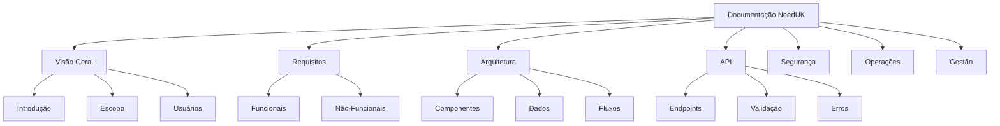

# Introdução

## Objetivo do Documento

Este documento tem por finalidade especificar de maneira formal, completa e técnica o sistema **NeedUK**. Descreve requisitos, arquitetura, design de dados, contratos de API, políticas de segurança, estratégias de teste, governança, operação e roadmap, de forma que terceiros (desenvolvedores, auditores, avaliadores ou futuros mantenedores) obtenham entendimento suficiente para manutenção, evolução e auditoria do sistema.

## Propósito do Sistema

O **NeedUK** foi desenvolvido para intermediar conexões entre estudantes, recrutadores e gestores universitários, suportando ciclos completos de:

- Autenticação e gerenciamento de perfis
- Atividades colaborativas
- Gestão de vagas e candidaturas
- Notificações em tempo real
- Sistema de reconhecimento (medalhas)

!!! abstract "Missão"
    Aumentar a empregabilidade estudantil e promover colaboração acadêmica através de uma plataforma integrada e eficiente.

## Alcance da Documentação

### O que está incluído

- ✅ Especificações técnicas completas
- ✅ Arquitetura e modelagem de dados
- ✅ Contratos de API detalhados
- ✅ Políticas de segurança e compliance
- ✅ Estratégias de teste e qualidade
- ✅ Processos de deploy e operação
- ✅ Governança e gestão de projeto
- ✅ Roadmap e evolução

### O que NÃO está incluído

- ❌ Código-fonte exato (fornecidos apenas padrões e exemplos)
- ❌ Configurações privadas de provedores
- ❌ Credenciais e segredos
- ❌ Dados sensíveis de produção

## Padrões e Referências

O desenvolvimento do NeedUK segue os seguintes padrões e metodologias:

| Aspecto | Padrão/Metodologia |
|---------|-------------------|
| Requisitos | IEEE 830 / ISO/IEC 29110 |
| Gestão de Projeto | Scrum híbrido (entregas quinzenais) |
| Segurança | OWASP Top 10 |
| API Design | RESTful best practices |
| Código | TypeScript + ESLint + Prettier |
| Commits | Conventional Commits |
| Versionamento | Semantic Versioning |

## Estrutura da Documentação

A documentação está organizada nas seguintes seções principais:

## Público-Alvo

Esta documentação é direcionada a:

| Perfil | Interesse Principal |
|--------|-------------------|
| **Desenvolvedores** | Arquitetura, API, código |
| **QA/Testers** | Testes, validações, fluxos |
| **DevOps** | Infraestrutura, deploy, operações |
| **Auditores** | Segurança, compliance, qualidade |
| **Product Owners** | Requisitos, roadmap, gestão |
| **Avaliadores Acadêmicos** | Visão completa do sistema |

## Como Usar Esta Documentação

### Para Novos Desenvolvedores

1. Comece pela [Visão Geral do Sistema](../overview/architecture.md)
2. Entenda a [Modelagem de Dados](../data/erd.md)
3. Estude os [Fluxos Críticos](../flows/critical-flows.md)
4. Consulte a [Referência de API](../api/conventions.md)
5. Leia os [Padrões de Código](../contributing/code-standards.md)

### Para Operações

1. Revise a [Infraestrutura](../infrastructure/overview.md)
2. Consulte os [Runbooks](../operations/runbooks.md)
3. Configure [Monitoramento](../operations/monitoring.md)
4. Entenda o [Plano de Backup](../backup/policy.md)

### Para Auditoria

1. Analise os [Requisitos de Segurança](../security/guidelines.md)
2. Revise a [Estratégia de Testes](../quality/testing.md)
3. Examine o [Registro de Riscos](../risks/register.md)
4. Verifique [Compliance](../security/compliance.md)

## Versionamento da Documentação

Esta documentação segue versionamento semântico:

- **MAJOR**: Mudanças incompatíveis na arquitetura/API
- **MINOR**: Novas funcionalidades mantendo compatibilidade
- **PATCH**: Correções e melhorias na documentação

!!! tip "Versão Atual"
    **v1.0.0** - Primeira versão completa da documentação (03/12/2025)

## Próximos Passos

Após ler esta introdução, recomendamos:

1. [:material-arrow-right: Visão Geral do Sistema](architecture.md)
2. [:material-arrow-right: Perfis de Usuário](../users/profiles.md)
3. [:material-arrow-right: Requisitos Funcionais](../requirements/functional.md)
